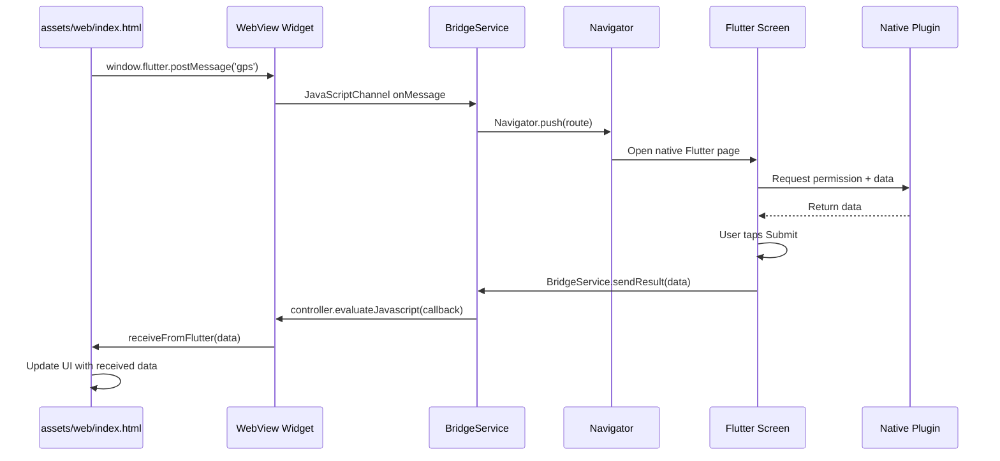

# WebView-to-Flutter Bridge App — Architecture Plan

## 1. Overview

A Flutter app demonstrating bidirectional communication between a local HTML/JS WebView and native Flutter screens. The main screen hosts a WebView; JavaScript calls Flutter via `JavaScriptChannel` to open native pages; Flutter sends results back to the WebView via `evaluateJavascript()`.

**Target Platforms**: Web (primary), Android, Windows

### Architecture Diagram



## 2. Project Structure (new & modified files)

```
lib/
├── main.dart                          # App entry + route table
├── screens/
│   ├── home_screen.dart               # WebView host (Android/Windows) or native UI (Web)
│   ├── home_screen_web.dart           # Native Flutter main page for Web platform
│   ├── gps_screen.dart                # GPS data collector
│   ├── camera_screen.dart             # Camera viewfinder + capture
│   ├── device_id_screen.dart          # Device identifier display
│   └── network_status_screen.dart     # Network info display
└── services/
    └── bridge_service.dart            # JS↔Flutter message hub (Android/Windows)

assets/
└── web/
    └── index.html                     # Local HTML for Android/Windows WebView
```

**Platform dispatch:** [`home_screen.dart`](lib/screens/home_screen.dart) detects the platform:
- **Android / Windows** → renders `WebViewWidget` loading `assets/web/index.html` with JavaScriptChannel
- **Web** → delegates to [`HomeScreenWeb`](lib/screens/home_screen_web.dart) which renders native Flutter buttons directly (no WebView needed on web; `webview_flutter` doesn't support Flutter Web)

## 3. Dependencies (pubspec.yaml)

| Package | Purpose | Version Constraint |
|---|---|---|
| `webview_flutter` | Embed WebView + JS bridge (Android/Windows) | `^4.10.0` |
| `webview_flutter_android` | Android WebView implementation | `^4.2.0` |
| `permission_handler` | Runtime permission requests (Android/Windows) | `^11.3.1` |
| `geolocator` | GPS location data | `^13.0.2` |
| `device_info_plus` | Device identifiers | `^11.3.3` |
| `connectivity_plus` | Network status info | `^6.1.4` |
| `camera` | Camera viewfinder + capture (Android/Windows) | `^0.11.1+1` |
| `path_provider` | Temp paths for camera images | `^2.1.5` |
| `cross_file` | Cross-platform file abstraction | `^1.0.0` |

## 4. Platform Permissions

### Android (`android/app/src/main/AndroidManifest.xml`)

```xml
<uses-permission android:name="android.permission.INTERNET"/>
<uses-permission android:name="android.permission.CAMERA"/>
<uses-permission android:name="android.permission.ACCESS_FINE_LOCATION"/>
<uses-permission android:name="android.permission.ACCESS_COARSE_LOCATION"/>
<uses-permission android:name="android.permission.ACCESS_WIFI_STATE"/>
<uses-permission android:name="android.permission.ACCESS_NETWORK_STATE"/>
<uses-permission android:name="android.permission.READ_PHONE_STATE"/>
```

### Windows — no manifest permissions needed; use Windows Settings > Privacy for camera/location

### Web — browser permission prompts handled automatically by `permission_handler` (or browser-native APIs)

## 5. Detailed Component Design

### 5.1 Bridge Service (`lib/services/bridge_service.dart`)

Singleton class that acts as a message hub:

- **`registerController(WebViewController)`** — Called from HomeScreen after WebView init.
- **`handleMessage(String action)`** — Called by JavaScriptChannel. Maps action string to route name. Opens fullscreen Flutter page via Navigator. Returns `Future<String?>` — the data from the Flutter page.

**Message contract (JS → Flutter):**

| Action String | Route | Flutter Screen |
|---|---|---|
| `"gps"` | `/gps` | GpsScreen |
| `"camera"` | `/camera` | CameraScreen |
| `"device_id"` | `/device_id` | DeviceIdScreen |
| `"network_status"` | `/network_status` | NetworkStatusScreen |

**Message contract (Flutter → JS):**

Each Flutter screen calls `Navigator.pop(context, resultJson)`. The BridgeService receives the result and calls:

```dart
controller.runJavaScript("receiveFromFlutter('$escapedJson')");
```

### 5.2 Home Screen (`lib/screens/home_screen.dart`)

- `initState`: calls `BridgeService.instance.registerController(controller)`
- `build`: returns a `Scaffold` whose body is a `WebViewWidget` loading `assets/web/index.html`
- Adds a `JavaScriptChannel` named `"FlutterBridge"` that routes messages to `BridgeService.handleMessage()`

### 5.3 Local HTML (`assets/web/index.html`)

A self-contained HTML page with:

- **Title**: "WebView Bridge Demo"
- **4 styled buttons**: GPS, Camera, Device ID, Network Status
- **Status area**: `<div>` that shows received data from Flutter
- **JavaScript functions**:
  - `callFlutter(action)` → calls `window.flutter.postMessage(action)`
  - `receiveFromFlutter(jsonStr)` → parses JSON, updates status area with the returned data
- **Button onclick handlers**: each calls `callFlutter('gps')`, `callFlutter('camera')`, etc.

### 5.4 GPS Screen (`lib/screens/gps_screen.dart`)

- On entry → request location permission via `permission_handler`
- If denied → show "Permission required" message with retry
- If granted → use `geolocator` to get:
  - Latitude, longitude
  - Altitude
  - Speed
  - Accuracy
  - Timestamp
- Display all values in a `Column` of `ListTile` widgets
- **Submit button** → `Navigator.pop(context, jsonEncode(dataMap))`

### 5.5 Camera Screen (`lib/screens/camera_screen.dart`)

- On entry → request camera permission via `permission_handler`
- If denied → show "Permission required" message with retry
- If granted → initialize `CameraController` with first rear camera
- Show `CameraPreview` widget as viewfinder
- **Capture button** → take picture, save to temp directory
- After capture → show preview of taken image
- **Submit button** → `Navigator.pop(context, jsonEncode({'imagePath': path, 'imageBase64': base64}))`
- **Retake button** → discard current image, return to viewfinder

### 5.6 Device ID Screen (`lib/screens/device_id_screen.dart`)

- On entry → check if `READ_PHONE_STATE` permission is needed (Android only, for IMEI). On iOS, use `identifierForVendor` which requires no runtime permission.
- Use `device_info_plus` to get `DeviceInfoPlugin().deviceInfo`
- Extract platform-appropriate identifiers:
  - **Android**: `androidId`, optionally `device` + `model` + `manufacturer`
  - **iOS**: `identifierForVendor`, `model` + `systemName`
- Display in a list
- **Submit button** → `Navigator.pop(context, jsonEncode(deviceDataMap))`

### 5.7 Network Status Screen (`lib/screens/network_status_screen.dart`)

- On entry → check network connectivity via `connectivity_plus`
- `Connectivity().checkConnectivity()` returns `ConnectivityResult`
- `Connectivity().getWifiName()` returns SSID (Android only; iOS needs location permission + `CNCopyCurrentNetworkInfo`)
- Display:
  - Connection type (WiFi / Cellular / None)
  - WiFi SSID if applicable
  - WiFi BSSID if available
- **Submit button** → `Navigator.pop(context, jsonEncode(networkDataMap))`

## 6. main.dart Design

```dart
void main() {
  WidgetsFlutterBinding.ensureInitialized();
  runApp(const MainApp());
}

class MainApp extends StatelessWidget {
  const MainApp({super.key});
  
  @override
  Widget build(BuildContext context) {
    return MaterialApp(
      debugShowCheckedModeBanner: false,
      title: 'WebView Bridge Demo',
      home: const HomeScreen(),
      routes: {
        '/gps': (_) => const GpsScreen(),
        '/camera': (_) => const CameraScreen(),
        '/device_id': (_) => const DeviceIdScreen(),
        '/network_status': (_) => const NetworkStatusScreen(),
      },
    );
  }
}
```

Routes use `Navigator.pushNamed` with `MaterialPageRoute(fullscreenDialog: true)` so that Flutter pages appear as fullscreen modal-style pages with a back arrow.

## 7. Platform-Specific Behavior

### Android (Primary)
- WebView loads `assets/web/index.html` via `flutter_assets`
- JavaScriptChannel `FlutterBridge` handles JS→Flutter messages
- Runtime permissions requested via `permission_handler`
- Camera uses `camera` plugin with CameraX
- GPS uses `geolocator` with Google Location Services
- Device ID uses `device_info_plus` (`androidId`)
- Network info uses `connectivity_plus` (WiFi SSID/BSSID available)

### Windows (Secondary)
- WebView loads `assets/web/index.html` locally
- JavaScriptChannel `FlutterBridge` handles JS→Flutter messages
- Location uses Windows Geolocation API (via `geolocator`)
- Camera uses Windows Camera API (via `camera` plugin)
- Device ID uses `device_info_plus` (machine GUID)
- Network info uses `connectivity_plus` (limited WiFi name support)

### Web (Secondary)
- No WebView needed; renders Flutter buttons natively via [`HomeScreenWeb`](lib/screens/home_screen_web.dart)
- Direct Navigator calls to Flutter screens (no JS bridge)
- Browser handles permission prompts for camera/location
- GPS uses browser Geolocation API
- Camera uses `MediaDevices.getUserMedia()`
- Device ID uses browser fingerprinting (limited)
- Network status uses `Navigator.onLine` + Network Information API

## 8. Data Flow Summary

```
User taps button in HTML (Android/Windows)
    → JS: window.flutter.postMessage('gps')
    → WebView: JavaScriptChannel.onMessage
    → BridgeService.handleMessage('gps')
    → BuildContext: Navigator.pushNamed('/gps')
    → Flutter screen opens
    → User views/collects data, taps Submit
    → Screen: Navigator.pop(context, jsonResult)
    → BridgeService receives result
    → BridgeService: controller.runJavaScript("receiveFromFlutter('...')")
    → HTML: receiveFromFlutter(jsonStr)
    → UI updates with returned data
```

## 9. Assets Configuration

In `pubspec.yaml`:
```yaml
flutter:
  assets:
    - assets/web/
```

## 10. Edge Cases & Considerations

- **Permission denied**: Each screen handles denial gracefully with a message and optional retry button.
- **WebView not ready**: BridgeService queues messages until controller is registered (or shows a SnackBar).
- **Platform differences**: WiFi name on Android requires `ACCESS_WIFI_STATE` permission. Windows has limited WiFi name access. Web uses `Navigator.onLine`.
- **Image handling**: Camera image is saved to temp directory; Base64 encoding is used for transport to the WebView to avoid file-path platform differences.
- **Back navigation from WebView**: The user can press back to close the Flutter screen without submitting (returns null).
- **Web fallback**: On Web platform, `HomeScreen` detects `kIsWeb` and renders `HomeScreenWeb` with native Flutter buttons instead of WebView.

## 11. Cleanup Tasks

- Delete `ios/` directory (not targeting iOS)
- Delete `macos/` directory (not targeting macOS)
- Delete `linux/` directory (not targeting Linux)

## 12. Implementation Order

1. Remove unused platform directories (ios, macos, linux)
2. Add Flutter dependencies to pubspec.yaml
3. Declare Android permissions in AndroidManifest.xml
4. Create local HTML asset
5. Implement bridge service
6. Implement home screen (with Web platform fallback)
7. Implement GPS screen
8. Implement Camera screen
9. Implement Device ID screen
10. Implement Network Status screen
11. Update main.dart with routes
12. Declare assets in pubspec.yaml
13. Verify build
